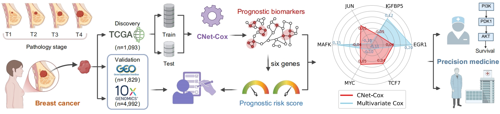

# [CNet-Cox: Network prognostic biomarkers identification by Cox proportional hazards model with connectivity network-regularized constraints](https://github.com/zpliulab/CNet-Cox)




## CNet-Cox
<!--START_SECTION:news-->
* A **connected network-regularized Cox roportional hazards model model** is proposed to perform **feature selection**. 
* In real-world **breast cancer (BRCA) dataset**, we validated the CNet-Cox model is efficient to identify the **connected-network-structured features** that can serve as **prognostic biomarkers**.
* In the comparison study, we also proved the proposed **CNet-Cox** results in better classification performance and feature interpretability than other seven method named **ENet-Cox**, **Lasso-Cox**, **L0-SVM**, **L1/2-Cox**, **SCAD-Cox**, **MCP-Cox** and **Ridge-Cox**.
* If you have any questions about **CNet-Cox**, please directly contact the corresponding author [Prof. Zhi-Ping Liu](https://scholar.google.com/citations?user=zkBXb_kAAAAJ&hl=zh-CN&oi=ao) with the E-mail: zpliu@sdu.edu.cn
<!--END_SECTION:news-->


## Citation
Li, Lingyu, and Zhi-Ping Liu. "**Machine learning-driven network biomarker discovery and risk scoring system construction for breast cancer prognosis**." Submiited to 
<!-- [Expert Systems with Applications](https://www.journals.elsevier.com/expert-systems-with-applications/).   -->

## R packages
* [glmSparseNet](https://bioconductor.org/packages/release/bioc/html/glmSparseNet.html) (v1.8.1). 
* [curatedTCGAData](https://www.bioconductor.org/packages/release/data/experiment/html/curatedTCGAData.html) (v1.12.1). 
* [TCGAutils](https://bioconductor.org/packages/release/bioc/html/TCGAutils.html) (v1.10.1). 
* [dplyr](https://cran.r-project.org/web/packages/dtplyr/index.html) (v1.0.8). To conduct regularized generalized Linear models (Elastic net penalty).
* [DESeq2](https://bioconductor.org/packages/release/bioc/html/DESeq2.html) (v1.30.1). 

## Data
<!--START_SECTION:news-->
* In the **CNet-SVM**, **NSLR_example** and **matlab_example** files, we give all **R/Matlab/Python** codes. 
* In the **Data** file, we give some necessary input/output files by the **R/Matlab/Python** codes. 
* Some input files only give the first few lines, but this does not affect the results of the work (**CNet-SVM**).
* In the **Supplementary file** file, we present the necessary **Additional files** contained in our work. 
<!--END_SECTION:news-->


## R codes for Data (RforData)
The **serial number (1), (2), ..., (16)** represents the order in which the program runs in our work. 
<!--START_SECTION:news-->
* (1) ``TCGA_pro_clin_DE.R``  --  Get data of all samples, select 112 Tumor + 112 Normal samples to and get DEGs.
* (2) ``thetaSelectGEDFN.R``  --  Use GCWs method get top 1% genes, repeat 10 times, make union.
* (3) ``malacards_GEDFN_mamaprint_KEGG.R``  --  Integrate data from MalaCards, KEGG, Mamaprint, GCWs, DEGs to union gene and corresponding expression data.
* (4) ``network_match_union.R``  --  Get the network of union gene in RegNetwork, extract the expression data of TCGA corresponding to union gene, and scale them.
* (5) ``data_splitnew.R``  --  According to the random seeds of other methods, the scaled data of the union gene of TCGA is divided into training data and testing data.
* (6) ``adj_union.R`` ---- Adjacency matrix and its eigenvalues.
* (7) ``cut_union.R`` ---- Diameters and cut-nodes of component of DEGs in RegNetwork.
<!--END_SECTION:news-->


## R codes for Result (RforResult)
The **serial number (1), (2), ..., (4)** represents the order in which the program runs in our work. 
<!--START_SECTION:news-->
* (1) ``feature_select_all_new.R`` -- Extract the common genes of TCGA and GEO, using the identified 32 genes. 
* (2) ``class_net_svm.R`` -- Train on TCGA data, predict on GEO data, apply linear svm classifier for classification, observe results.
* (3) ``network_match_all_new.R`` -- Extract the net information of the biomarkers identified by each method.
* (4) ``ROCplot.R`` -- Plot ROC curves on independent datasets.
<!--END_SECTION:news-->


## Matlab codes for simulating datasets (SVMexamplenew)
<!--START_SECTION:news-->
* (1) ``SVMmainexample.m`` -- main function.
    ```ruby
    To test CNet-SVM method on simulation data, simply uses the script 'matlab -r SVMmainexample.m'.
    ```
* (2) ``costFunctionSVM.m`` -- Objective function.
* (3) ``cvSVM.m`` -- Cross validation to select optimal parameters.
* (4) ``Laplcian_Matrix.m`` -- Laplacian matrix according to the adjacency matrix.
* (5) ``LogitisLapSVM.m`` -- LogitisLap function for CV.
* (6) ``SGNLR.m`` -- SGNLR function for LogitisLap.
* (7) ``ErrorSVM.m`` -- Error function.
* (8) ``getLambMaxSVM.m`` -- getLambMax function for cv.
* (9) ``PredictSVM.m`` -- Predict function on test dataset.
* (10) ``plotROC.m`` -- Roc curve function on test dataset.
* (11) ``printConMat`` -- Output confusion matrix.
<!--END_SECTION:news-->


## Python codes (GEDFNsvm)
<!--START_SECTION:news-->
* (1) ``main_SVM.py`` -- GCWs methods for feature selection.
    ```ruby
    To conduct GCWs method, simply use script 'python main_SVM.py'.
    ```
* (2*) ``rfe_rf_R3.ipynb`` -- Newly add Random Forest (RF) method to compare with CNet-SVM.
    ```ruby
    To test RF method on whole 1205 BRCA data, simply run 'rfe_rf_R3.ipynb' use jupyter notebook.
    ```
<!--END_SECTION:news-->