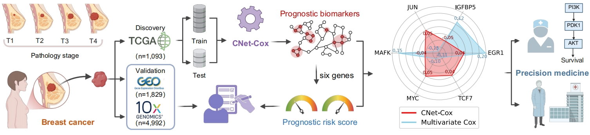

# [CNet-Cox for interpretable network biomarker discovery and survival risk scoring in precise breast cancer prognosis](https://github.com/zpliulab/CNet-Cox)

<!-- CNet-Cox: Network prognostic biomarkers identification by Cox proportional hazards model with connectivity network-regularized constraints -->




## CNet-Cox
<!--START_SECTION:news-->
* A **C**nnected **Net**work-regularized **Cox** roportional hazards model (**CNet-Cox**) is proposed to perform **feature selection**. 
* In real-world **breast cancer (BRCA) dataset**, we validated the CNet-Cox model is efficient to identify the **connected-network-structured features** that can serve as **prognostic biomarkers**.
* In the comparison study, we also proved the proposed **CNet-Cox** results in better classification performance and feature interpretability than other seven method named **ENet-Cox**, **Lasso-Cox**, **L0-Cox**, **L1/2-Cox**, **SCAD-Cox**, **MCP-Cox** and **Ridge-Cox**.
* If you have any questions about **CNet-Cox**, please directly contact the corresponding author [Prof. Zhi-Ping Liu](https://scholar.google.com/citations?user=zkBXb_kAAAAJ&hl=zh-CN&oi=ao) with the E-mail: zpliu@sdu.edu.cn
<!--END_SECTION:news-->


## Citation
Lingyu Li, Weiqin Zhao, Qingpeng Zhang, Wai-Ki Ching* and Zhi-Ping Liu*. "**CNet-Cox for interpretable network biomarker discovery and survival risk scoring in precise breast cancer prognosis**." Submited to [npj Digital Medicine](https://www.nature.com/npjdigitalmed/).


## R packages
* [glmSparseNet](https://bioconductor.org/packages/release/bioc/html/glmSparseNet.html) (v1.8.1). 
* [curatedTCGAData](https://www.bioconductor.org/packages/release/data/experiment/html/curatedTCGAData.html) (v1.12.1). 
* [TCGAutils](https://bioconductor.org/packages/release/bioc/html/TCGAutils.html) (v1.10.1). 
* [dplyr](https://cran.r-project.org/web/packages/dtplyr/index.html) (v1.0.8). 
* [DESeq2](https://bioconductor.org/packages/release/bioc/html/DESeq2.html) (v1.30.1). 
* [igraph](https://cran.r-project.org/web/packages/igraph/index.html) (v2.1.4). 
* [caret](https://cran.r-project.org/web/packages/caret/index.html) (v7.0-1). 
* [dplyr](https://cran.r-project.org/web/packages/dtplyr/index.html) (v1.3.1). 
* [tidyverse](https://cran.r-project.org/web/packages/tidyverse/index.html) (v2.0.0). 
* [rlang](https://cran.r-project.org/web/packages/rlang/index.html) (v1.1.6). 
* [survival](https://cran.r-project.org/web/packages/survival/index.html) (v3.8.3). 
* [glmSparseNet](https://bioconductor.org/packages/release/bioc/html/glmSparseNet.html) (v1.8.6). 
* [survminer](https://cran.r-project.org/web/packages/survminer/index.html) (v0.5.0). 
* [litedown](https://cran.r-project.org/web/packages/litedown/index.html) (v0.7). 


## Data
<!--START_SECTION:news-->
* **Code** provides all **R/Matlab/Python** scripts required to reproduce and utilize **CNet-Cox**. 
* **Data** gives necessary input/output files by the **R/Matlab/Python** codes. *Note: Some input files only give the first few lines due to upload size limitation, but this does not affect the results of **CNet-Cox**.* Especially, *Independent_data* and *Feature_data* are two files (original expression and PRS gene expression) from independent GEO datasets (See ``feature_select_GEO.R``).
* **Supp** presents additional supporting files that contained in **CNet-Cox**. 
* **Validation** provides the original supporting files (high-resolution images) used for validating the PRS genes induced by **CNet-Cox** for breast cancer. 
<!--END_SECTION:news-->


## R codes for Data 
The **number (1), (2), ...** represents the order in which the Sript runs in CNet-Cox. 
<!--START_SECTION:news-->
* (1) ``TCGA_pro_clin_DE.R``  --  Download gene expression datat of BRCA samples with clinical information, select  928 "surviving" + 152 "deceased" samples to get 196 DEGs and make Volcano plot (Fig. 2A), and integrate DEGs with prior knowledges, select component and node-cut set.
* (2) ``Data_split.R``  --  According to the random seeds of other methods, the scaled data of the union gene of TCGA is divided into training data and testing data.
* (3) ``TCGA_pro_clin_Cox_544_rep5.R``  --  Run compared methods (ENet-Cox, L0-Cox, L1/2-Cox, Lasso-Cox, MCP-Cox, SCAD-Cox), with **input** 'TCGA_BRCA_clin_546_1080.txt'.
```bash
library(curatedTCGAData)
brca <- curatedTCGAData(diseaseCode = "BRCA", assays = "RNASeq2GeneNorm", version = "1.1.38", dry.run = FALSE)
```
<!--END_SECTION:news-->


## R codes for Result 
The **number (1), (2), ..., (4)** represents the order in which the program runs in our work. 
<!--START_SECTION:news-->
* (1) ``CI_repeat.R`` -- Feature network of CNet-Cox (Fig. 2B); Survival analysis of 68 prognostic  markers (Fig. 2G); Univariate and multivariate Cox analysis (Tab. S4); Anthracycline-sensitive validation (Fig. 3F,G); Internal validation using six-gene PRS (Fig. 4B); Overlap of oncotype21 and mamamprint70 (Fig. Sx).
* (2) ``feature_select_GEO.R`` -- Select expression of six genes in PRS (with time and clinical information; [8*159]) from external GEO datasets. **Input**: Data/Independent_data. **Output**: Data/Feature_data/Data_GEO.
* (3) ``feature_survival_external_index.R`` -- Calculate PRS values based on PRS in Eq. (1) on external GEO datasets (from *feature_select_GEO.R*). 
* (4) ``class_net_Cox.R`` -- Train on TCGA data, predict on GEO data, apply linear Cox classifier for classification, observe results.
* (5) ``network_match_all_new.R`` -- Extract the net information of the biomarkers identified by each method.
* (6) ``ROCplot.R`` -- Plot ROC curves on independent datasets.
* (7) ``GSE96058_expr.R``  --  [For revision] External validation using new breast cancer subtype dataset, CNet-Cox gets good prognostic risk prediction using PRS index for ER+ and TNBC patients. 
<!--END_SECTION:news-->


## Matlab codes
<!--START_SECTION:news-->
**Note**: If you encounter the error **Unrecognized function or variable 'cvx_begin'.**, it means the ``cvx`` package has not been installed.

- It needs download ``cvx`` package from [CVX Home Page](http://cvxr.com/cvx/download/), where *Standard bundles* for Linux, Mac and Windoes can be chosen. 

- Then, unzip the downloaded file to your chosen directory (e.g., D:\Applications\MATLAB\R2020a\toolbox). To install in Matlab, simply run the script at **Command Window** of Matlab:
```bash
cd 'D:\Applications\MATLAB\R2020a\toolbox\cvx'  # my mathlab path
cvx_setup
```

To evaluate CNet-Cox on *Data_train* and *Data_test*, simply run the provided script:
```bash
cd CNet-Cox/Code/Matlab
matlab  # activate matlab R2020a or R2020b
matlab -r Coxmain.m
```
* (1) ``Coxmain.m`` -- main function.
* (2) ``costFunctionCox.m`` -- Objective function.
* (3) ``cvCox.m`` -- Cross validation to select optimal parameters.
* (4) ``cvCoxexample.m`` -- Cross validation to select optimal parameters - an example.
* (5) ``Laplcian_Matrix.m`` -- Laplacian matrix according to the adjacency matrix.
* (6) ``LogitisLapCox.m`` -- LogitisLap function for CV.
* (7) ``LogitisLapCoxexample.m`` -- LogitisLap function for CV - an example.
* (8) ``SGNLR.m`` -- SGNLR function for LogitisLap.
* (9) ``getLambMaxCox.m`` -- getLambMax function for cv.
* (10) ``PredictSVM.m`` -- Predict function on test dataset.
* (11) ``plotROC.m`` -- Roc curve function on test dataset.
* (12) ``confusion.m`` -- Confusion matrix.
* (13) ``printConMat.m`` -- Output confusion matrix.
* (14) ``RiskMatrix.m`` -- Risk mmatrix constuction.
* (15) ``RiskMatrixexample.m`` -- Risk mmatrix constuction - an example.
<!--END_SECTION:news-->


## Python codes
<!--START_SECTION:news-->
* (1) ``Fig1A_Radar_figure.ipynb`` -- Plot the radar figure.
* (2) ``Spatial_validation_externaldata.ipynb`` -- Validate PRS gene on spatial dataset and compare PRS score with MammaPrint and OncotypeDX.
<!--END_SECTION:news-->
